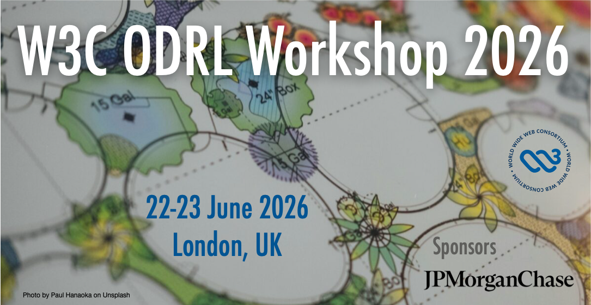

# W3C Workshop on the Future ODRL Directions
##### Exploring new ODRL Adoption, Policy Semantics & Evaluation and the Future of Policy Management on the Web  

---

---

📍 Location:  **25 Bank St, Canary Wharf, London, UK**  
📅 Dates: **22/23 June 2026**  
📢 Call for Participation: **17 April 2026**  

---

## Overview

The **W3C Workshop on ODRL** will bring together industry adopters, implementers, researchers, standards contributors, and community members to explore and set the future state of the **ODRL** roadmap.

ODRL is a W3C Recommendation for expressing interoperable usage control policies for digital content, services, and data. Adoption is rapidly increasing across data spaces, trusted data ecosystems, digital media standards, the cultural sector, financial data and governance frameworks. 

Currently, ODRL is managed by the [W3C ODRL Community Group](http://www.w3.org/community/odrl/) that develops new profiles and best practices guides for the [W3C ODRL Information Model](https://www.w3.org/TR/odrl-model/) and the [W3C ODRL Vocabulary](https://www.w3.org/TR/odrl-vocab/) recommendations.

This workshop aims to:
- Explore future roadmap directions for ODRL  
- Identify semantic technical gaps  
- Explore new communities and sectors adoping ODRL
- Share real-world implementation experiences  
- Highlight implementation and policy evaluation approaches  

---

## Important Dates 

| Milestone | Date |
|-----------|------|
| Call for Participation Published | **17 April 2026**  (Tentative) |
| Deadline for Talk/Position Papers Proposals | **1 May 2026** (Tentative) |
| Notification to Speakers | **8 May 2026** (Tentative) |
| Workshop Dates | **22 and 23 June 2026** |

---

## Why This Workshop?

Since becoming a W3C Recommendation in 2018, ODRL has gained increasing recognition and adoption across:

- Data space governance frameworks  
- Industry consortia and international standards  
- Digital media and creative content providers  
- Financial sectors  

At the same time, important challenges remain:

- Policy interoperability across domains  
- Runtime enforcement and compliance verification  
- Profile development and extension governance  
- Tooling maturity and usability  
- Integration with emerging Web standards  

This workshop provides a forum to examine these topics collaboratively and define next steps.

---

## Topics of Interest

We invite proposals for short talks (10–15 minutes) on topics including, but not limited to:

### ODRL Adoption & Industry Experience

- Case studies of ODRL deployments  
- Lessons learned from production implementations  
- Integration within data ecosystems and digital platforms  
- Governance and compliance use cases  
- ODRL Linked data integration
- ODRL best practices
- Profiles and domain-specific extensions

### Innovation and Semantics of ODRL  

- Formal semantics of ODRL
- Policy evaluation engines 
- Constraint modeling  
- ODRL editors, validators, and libraries  
- Automated policy generation  
- AI-assisted policy authoring and validation  
- Conformance and testing mechanisms

### Interoperability & Architecture

- ODRL and access control systems  
- Alignment with data space architectures  
- Integration with Verifiable Credentials and DIDs  
- Enforcement architectures and policy decision points  

### Roadmap & Community Development

- Gaps in the current ODRL Information Model  
- Requirements for future revisions  
- Governance of vocabularies and profiles  
- Community sustainability and collaboration  

---

## Format

The workshop will include:

- Presentations (10–15 minutes each)  
- Moderated discussion sessions  
- Thematic breakout discussions  
- Consolidated reporting of outcomes  

All accepted talks and slides will be made publicly available after the event.

---

## Submitting a Proposal

To propose a talk or position paper, please submit:

1. Name  
2. Affiliation  
3. Short biography (2–3 sentences)  
4. Proposed talk title and abstract (3–5 sentences), or  
6. Position Paper (2 to 4 pages)  

Submission details: *TBD (form or email to be announced)*

We especially encourage submissions from industry implementers and tool builders.

---

## Expected Outcomes

The workshop aims to produce:

- A public summary report  
- A snapshot of current ODRL adoption  
- Identified technical gaps and requirements  
- Inputs to inform the ODRL roadmap  
- Strengthened community coordination  

The cullmination of the workshop will be a **proposal for a new W3C ODRL Working Group** to undertake the identified tasks. The Charter of the proposed WG will be presented at the [W3C TPAC Meeting](https://www.w3.org/events/tpac/2026/tpac-2026/) (26-30 October 2026, Dublin, Ireland)

---

## Who Should Attend?

- New adoptors and implementors of ODRL
- Data space architects  
- Digital rights and governance professionals  
- Media Standards contributors  
- Researchers in policy languages and asset control  
- Tool developers and platform providers  

---

## Program Committee

Co-Chairs: 
- [Renato Iannella](https://www.linkedin.com/in/riannella/), TRIPLES
- [Nicoletta Fornara](https://www.linkedin.com/in/nicoletta-fornara-0384397/), USI Università della Svizzera Italiana
- [Víctor Rodríguez-Doncel](https://www.linkedin.com/in/victor-rodriguez-doncel/), Universidad Politécnica de Madrid

W3C Contacts: [Rigo Wenning](https://www.linkedin.com/in/rigo-wenning-0779212/) (rigo at_ w3.org)   

Program Committee (**Pending to be confirmed**): 
- Beatriz Esteves
- Rigo Wenning
- Pierre-Antoine Champin
- Ben Wittham-Smith
- Andrea Cimmino
- Matthias Autrata 
- Simon Steyskal
- Joshua Cornejo
- Yassir Sellami
- Wout Slabbinck
- Philippe Rixhon
- Brendan Quinn

The Program Committee will review submissions and shape the final agenda.

---

## Code of Conduct

This workshop follows the  
[W3C Code of Ethics and Professional Conduct (CEPC)](https://www.w3.org/Consortium/cepc/)

We are committed to providing a welcoming and inclusive environment for all participants.

---

## Contact

For questions or suggestions, please contact the Workshop Chairs.

---

© 2026 W3C Workshop on ODRL  

