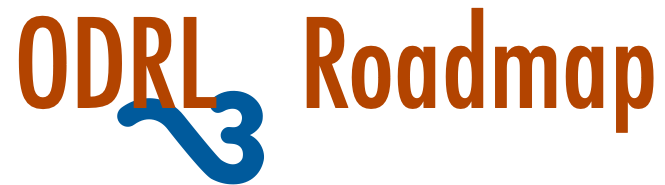

 

Objective: Propose a plan for the development of ODRL3 as a new W3C Recommendation

Motivation: ODRL is being adopted across various industries and becoming part of the underlying platform for many sectors and major projects:
 - See [W3C blog post](https://www.w3.org/blog/2025/w3c-standard-odrl-policy-gaining-industry-adoption/)
 - Growing [ODRL Landscape](https://w3c.github.io/odrl/landscape/)
 - Five community group [working documents](https://github.com/w3c/odrl/?tab=readme-ov-file#current-working-documents).

Timescale: Target W3C TPAC Meeting (Oct 2026 in Dublin) for a Proposed new Working Group Charter

Process:
 - Define current ODRL issues (that challenge deployment)
 - Source ODRL Features (from current and new communities) that will provide new capabilities
  - Collect use cases and extract requirements
 - Develop a conceptual draft of ODRL3
 - Document proposed Charter for new W3C Working Group for 2027/28
 - Socialise with wider community and W3C Staff

Current Activities:
 - Tracking items on Github with [ODRL-3](https://github.com/w3c/odrl/issues?q=is%3Aissue%20state%3Aopen%20label%3AODRL-3) tag
 - A [Roadmap Brainstorm](https://github.com/w3c/odrl/wiki/Roadmap-brainstorm)